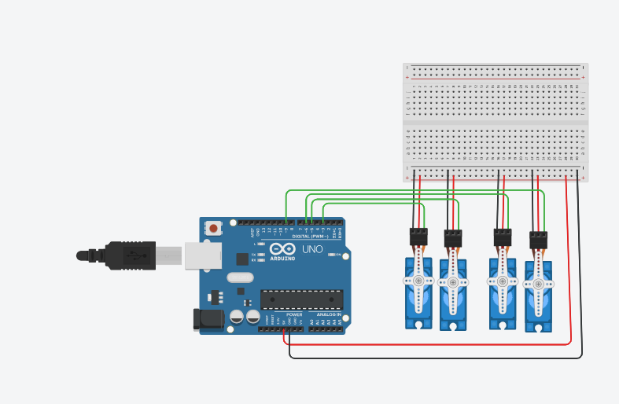

# Four Servo Motors Control Using Arduino

## Project Overview

This project demonstrates controlling four servo motors using an Arduino Uno in Tinkercad.

The objective is to program the four servo motors to perform two actions in sequence:

1. Run a Sweep movement for 2 seconds.
2. After that, all servo motors hold their position at 90 degrees.

## Components Used

- Arduino Uno
- 4 Servo Motors
- Breadboard
- Jumper Wires

## Circuit Connections

The servo motors are connected as follows:

| Servo Motor | Signal Pin |
|------------|------------|
| Servo 1 | D3 |
| Servo 2 | D5 |
| Servo 3 | D6 |
| Servo 4 | D9 |

Power connections:
- Servo Power → Breadboard (+) connected to Arduino 5V.
- Servo Ground → Breadboard (-) connected to Arduino GND.

## Implementation

The Arduino code uses the Servo library to control the four motors.

During the first two seconds, all motors perform a continuous Sweep movement from 0 to 180 degrees and back.

After completing the Sweep movement, all motors are positioned and held at 90 degrees.

## Simulation

The circuit was designed and tested using Tinkercad.

### Circuit Diagram

### Simulation Video

The simulation demonstrates the required movement sequence:

- Sweep movement for 2 seconds.
- Holding all servo motors at 90 degrees.

## Files

- `Four_Servo_Motors.ino` : Arduino source code.
- `circuit.png` : Tinkercad circuit screenshot.
- `simulation.mp4` : Simulation video.

## Author

Raghad Alhamad

Smart Methods Summer Training 2026
